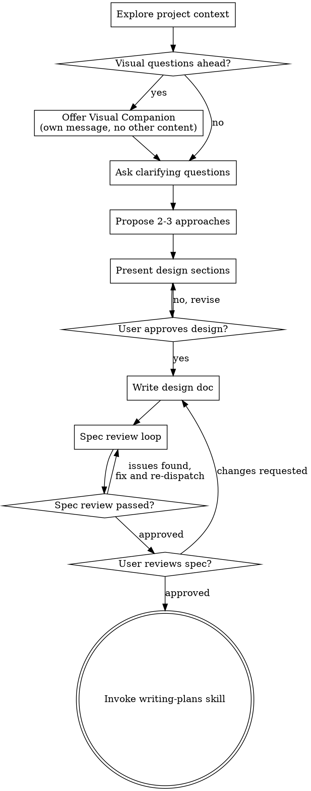

# Brainstorming Ideas Into Designs

Help turn ideas into fully formed designs and specs through natural collaborative dialogue.

Start by understanding the current project context, then ask questions one at a time to refine the idea. Once you understand what you're building, present the design and get user approval.

<HARD-GATE>
Do NOT invoke any implementation skill, write any code, scaffold any project, or take any implementation action until you have presented a design and the user has approved it. This applies to EVERY project regardless of perceived simplicity.
</HARD-GATE>

## Anti-Pattern: "This Is Too Simple To Need A Design"

Every project goes through this process. A todo list, a single-function utility, a config change — all of them. "Simple" projects are where unexamined assumptions cause the most wasted work. The design can be short (a few sentences for truly simple projects), but you MUST present it and get approval.

## Checklist

You MUST create a task for each of these items and complete them in order:

0. **Workflow setup** — Generate workflow ID and log skill invocation:
   ```bash
   WF_ID=$(uuidgen 2>/dev/null || python3 -c "import uuid; print(uuid.uuid4())")
   mkdir -p .stellar-powers/specs .stellar-powers/plans
   echo "{\"ts\":\"$(date -u +%Y-%m-%dT%H:%M:%SZ)\",\"event\":\"skill_invocation\",\"workflow_id\":\"${WF_ID}\",\"session\":\"\",\"data\":{\"skill\":\"brainstorming\",\"args\":\"$(echo "$ARGS" | sed 's/"/\\\\"/g')\"}}" >> .stellar-powers/workflow.jsonl
   ```
   Also check `.stellar-powers/workflow.jsonl` for incomplete brainstorming workflows. If found, load the most recent workflow's context (spec path, last event) to inform your work. Do not re-prompt the user — session-start already surfaced incomplete work.

   **Workflow gate** — After generating WF_ID, check for an existing active workflow:
   ```bash
   AW_FILE=".stellar-powers/.active-workflow"
   if [ -f "$AW_FILE" ]; then
     AW_JSON=$(cat "$AW_FILE" 2>/dev/null)
     AW_VALID=$(echo "$AW_JSON" | python3 -c "import json,sys; json.load(sys.stdin); print('yes')" 2>/dev/null)
     if [ "$AW_VALID" != "yes" ]; then
       echo "Corrupted workflow state detected and cleared. Starting fresh."
       rm -f "$AW_FILE"
     else
       AW_WF_ID=$(echo "$AW_JSON" | python3 -c "import json,sys; print(json.load(sys.stdin).get('workflow_id',''))")
       AW_TOPIC=$(echo "$AW_JSON" | python3 -c "import json,sys; print(json.load(sys.stdin).get('topic',''))")
       AW_SKILL=$(echo "$AW_JSON" | python3 -c "import json,sys; print(json.load(sys.stdin).get('skill',''))")
       ALREADY_DONE=$(grep -c "\"workflow_completed\".*${AW_WF_ID}\|\"workflow_abandoned\".*${AW_WF_ID}" .stellar-powers/workflow.jsonl 2>/dev/null || echo 0)
       if [ "$ALREADY_DONE" -gt 0 ]; then
         rm -f "$AW_FILE"
       else
         # Different topic — present options to user
         echo "There is an active workflow (skill=${AW_SKILL}, topic=${AW_TOPIC}). Options: [complete] finish it first, [abandon] discard it, [hold] park it and start new, [resume] switch to it."
         # Act on user's choice before continuing
       fi
     fi
   fi
   HELD_COUNT=$(ls .stellar-powers/.active-workflow.held.* 2>/dev/null | wc -l | tr -d ' ')
   if [ "$HELD_COUNT" -gt 0 ]; then
     echo "Note: ${HELD_COUNT} workflow(s) on hold."
   fi
   ```

   **Create .active-workflow** — After the gate passes, write the active workflow file and log workflow_started:
   ```bash
   REPO=$(basename $(git remote get-url origin 2>/dev/null | sed 's/.git$//') 2>/dev/null || basename $(pwd))
   SP_VERSION=$(python3 -c "import json; print(json.load(open('$(find ~/.claude/plugins/cache/stellar-powers -name package.json -maxdepth 4 2>/dev/null | head -1)'))['version'])" 2>/dev/null || echo "unknown")
   cat > .stellar-powers/.active-workflow.tmp << AWEOF
   {"workflow_id":"${WF_ID}","skill":"brainstorming","topic":"TOPIC_FROM_ARGS","step":"workflow_setup","step_number":0,"started":"$(date -u +%Y-%m-%dT%H:%M:%SZ)","repo":"${REPO}","task_type":"TASK_TYPE","sp_version":"${SP_VERSION}"}
   AWEOF
   mv .stellar-powers/.active-workflow.tmp .stellar-powers/.active-workflow
   echo "{\"ts\":\"$(date -u +%Y-%m-%dT%H:%M:%SZ)\",\"event\":\"workflow_started\",\"workflow_id\":\"${WF_ID}\",\"session\":\"${CLAUDE_SESSION_ID:-}\",\"data\":{\"skill\":\"brainstorming\",\"topic\":\"TOPIC_FROM_ARGS\",\"repo\":\"${REPO}\",\"sp_version\":\"${SP_VERSION}\"}}" >> .stellar-powers/workflow.jsonl
   ```
   Replace `TOPIC_FROM_ARGS` with the actual topic from the user's request.
   Replace `TASK_TYPE` by inferring from the user's args: "feature" for new features, "bugfix" for fixes, "refactoring" for refactors, "porting" for feature porting. If unclear, default to "feature". Update `.active-workflow` with the correct task_type once determined (e.g., during clarifying questions).

   **Step logging** — At the start and end of each major checklist step, log step_started and step_completed events to workflow.jsonl:
   ```bash
   # Log at step start (replace STEP_NAME and N with actual values)
   echo "{\"ts\":\"$(date -u +%Y-%m-%dT%H:%M:%SZ)\",\"event\":\"step_started\",\"workflow_id\":\"${WF_ID}\",\"session\":\"${CLAUDE_SESSION_ID:-}\",\"data\":{\"skill\":\"brainstorming\",\"step\":\"STEP_NAME\",\"step_number\":N}}" >> .stellar-powers/workflow.jsonl

   # Log at step end
   echo "{\"ts\":\"$(date -u +%Y-%m-%dT%H:%M:%SZ)\",\"event\":\"step_completed\",\"workflow_id\":\"${WF_ID}\",\"session\":\"${CLAUDE_SESSION_ID:-}\",\"data\":{\"skill\":\"brainstorming\",\"step\":\"STEP_NAME\",\"step_number\":N}}" >> .stellar-powers/workflow.jsonl
   ```
1. **Explore project context** — check files, docs, recent commits. After completing, update .active-workflow:
   ```bash
   python3 -c "
   import json
   aw = json.load(open('.stellar-powers/.active-workflow'))
   aw['step'] = 'explore_context'
   aw['step_number'] = 1
   json.dump(aw, open('.stellar-powers/.active-workflow.tmp', 'w'))
   " && mv .stellar-powers/.active-workflow.tmp .stellar-powers/.active-workflow
   ```
2. **Offer visual companion** — if the topic involves UI, frontend, or any visual output, you MUST offer the visual companion (mockups are critical for alignment on UI work). For non-visual topics, offer only if diagrams would help. This is its own message, not combined with a clarifying question. See the Visual Companion section below.
3. **Ask clarifying questions** — check for cross-project porting intent first (see "Cross-project feature porting" section), then ask one at a time to understand purpose/constraints/success criteria. After completing, update .active-workflow:
   ```bash
   python3 -c "
   import json
   aw = json.load(open('.stellar-powers/.active-workflow'))
   aw['step'] = 'clarifying_questions'
   aw['step_number'] = 3
   json.dump(aw, open('.stellar-powers/.active-workflow.tmp', 'w'))
   " && mv .stellar-powers/.active-workflow.tmp .stellar-powers/.active-workflow
   ```
4. **Propose 2-3 approaches** — with trade-offs and your recommendation. After completing, update .active-workflow:
   ```bash
   python3 -c "
   import json
   aw = json.load(open('.stellar-powers/.active-workflow'))
   aw['step'] = 'propose_approaches'
   aw['step_number'] = 4
   json.dump(aw, open('.stellar-powers/.active-workflow.tmp', 'w'))
   " && mv .stellar-powers/.active-workflow.tmp .stellar-powers/.active-workflow
   ```
5. **Present design** — in sections scaled to their complexity, get user approval after each section. After completing, update .active-workflow:
   ```bash
   python3 -c "
   import json
   aw = json.load(open('.stellar-powers/.active-workflow'))
   aw['step'] = 'present_design'
   aw['step_number'] = 5
   json.dump(aw, open('.stellar-powers/.active-workflow.tmp', 'w'))
   " && mv .stellar-powers/.active-workflow.tmp .stellar-powers/.active-workflow
   ```
6. **Write design doc** — save to `.stellar-powers/specs/YYYY-MM-DD-<topic>-design.md` and commit. After completing, update .active-workflow:
   ```bash
   python3 -c "
   import json
   aw = json.load(open('.stellar-powers/.active-workflow'))
   aw['step'] = 'write_doc'
   aw['step_number'] = 6
   json.dump(aw, open('.stellar-powers/.active-workflow.tmp', 'w'))
   " && mv .stellar-powers/.active-workflow.tmp .stellar-powers/.active-workflow
   ```
7. **Spec review loop** — dispatch spec-document-reviewer subagent with precisely crafted review context (never your session history); fix issues and re-dispatch until approved (max 3 iterations, then surface to human). After completing, update .active-workflow:
   ```bash
   python3 -c "
   import json
   aw = json.load(open('.stellar-powers/.active-workflow'))
   aw['step'] = 'spec_review'
   aw['step_number'] = 7
   json.dump(aw, open('.stellar-powers/.active-workflow.tmp', 'w'))
   " && mv .stellar-powers/.active-workflow.tmp .stellar-powers/.active-workflow
   ```
8. **User reviews written spec** — ask user to review the spec file before proceeding. After completing, update .active-workflow:
   ```bash
   python3 -c "
   import json
   aw = json.load(open('.stellar-powers/.active-workflow'))
   aw['step'] = 'user_review'
   aw['step_number'] = 8
   json.dump(aw, open('.stellar-powers/.active-workflow.tmp', 'w'))
   " && mv .stellar-powers/.active-workflow.tmp .stellar-powers/.active-workflow
   ```
9. **Transition to implementation** — set up a git worktree for isolated implementation (invoke `stellar-powers:using-git-worktrees`), then invoke writing-plans skill to create implementation plan

## Process Flow



**The terminal state is invoking writing-plans.** Do NOT invoke frontend-design, mcp-builder, or any other implementation skill. The ONLY skill you invoke after brainstorming is writing-plans.

## The Process

**Understanding the idea:**

- Check out the current project state first (files, docs, recent commits)
- Before asking detailed questions, assess scope: if the request describes multiple independent subsystems (e.g., "build a platform with chat, file storage, billing, and analytics"), flag this immediately. Don't spend questions refining details of a project that needs to be decomposed first.
- If the project is too large for a single spec, help the user decompose into sub-projects: what are the independent pieces, how do they relate, what order should they be built? Then brainstorm the first sub-project through the normal design flow. Each sub-project gets its own spec → plan → implementation cycle.
- For appropriately-scoped projects, ask questions one at a time to refine the idea
- Prefer multiple choice questions when possible, but open-ended is fine too
- Only one question per message - if a topic needs more exploration, break it into multiple questions
- Focus on understanding: purpose, constraints, success criteria

**Cross-project feature porting:**

- **Loop guard:** If brainstorming was invoked from `stellar-powers:feature-porting` (i.e., args contain a reference to a feature extraction report at `.stellar-powers/reports/`), skip intent detection entirely — the porting scan is already done. Go straight to reading the report and using it as context.
- Before asking the first clarifying question at step 3, check whether the user's initial message matches cross-project porting intent — references to porting, extracting, migrating, or reusing a feature from another local project. See `feature-porting/SKILL.md` for the canonical trigger phrase list.
- If detected, ask: "It sounds like you want to port a feature from another project. Should I run a feature extraction scan first?"
- If yes: invoke `stellar-powers:feature-porting` skill with any source path and feature name parsed from the user's message as args (e.g., args: `"source=/path/to/project feature=billing"`). It runs its full flow (input collection, scan, approval). Once approved, control returns here.
- If the user provides an existing report path (e.g., "I already have the extraction report at .stellar-powers/reports/..."), read that specific path. No scan needed.
- After feature-porting completes or a report is provided, resume at step 3. Treat the extraction report as a requirements document — don't re-ask questions the report already answers. Focus clarifying questions on adaptation decisions (e.g., "the source uses X approach but the target uses Y — which do you prefer?").

**Exploring approaches:**

- Propose 2-3 different approaches with trade-offs
- Present options conversationally with your recommendation and reasoning
- Lead with your recommended option and explain why

**Library verification (Context7):**

- When proposing approaches that recommend specific libraries, fetch current docs via Context7 to verify API assumptions. Set `QUERY` to the specific API topic (e.g., `"app router"` not just `"nextjs"`):
  ```bash
  LIB_ID=$(curl -s --max-time 10 "https://context7.com/api/v2/libs/search?libraryName=${LIBRARY}" \
    -H "Authorization: Bearer $CONTEXT7_API_KEY" \
    | python3 -c "import sys,json; r=json.load(sys.stdin).get('results',[]); print(max(r, key=lambda x: x.get('trustScore',0))['id'] if r else '')" 2>/dev/null)
  if [ -n "$LIB_ID" ]; then
    curl -s --max-time 10 "https://context7.com/api/v2/context?libraryId=${LIB_ID}&query=${QUERY}&tokens=5000&type=txt" \
      -H "Authorization: Bearer $CONTEXT7_API_KEY" 2>/dev/null
  fi
  ```
- Include version info in the approach (e.g., "Next.js 15 — App Router with Server Components")
- Check the project's pinned version matches — don't recommend patterns from a newer major version than the project uses
- If a proposed pattern is deprecated, note it in the trade-offs and use the current pattern
- If this brainstorming session results in a spec document, include a `## Library References` appendix (max ~200 tokens per library, 3-5 key patterns)
- Skip utility libs (lodash, zod) and private `@org/` packages
- If `CONTEXT7_API_KEY` is not set, proceed without verification — note this once

**Presenting the design:**

- Once you believe you understand what you're building, present the design
- Scale each section to its complexity: a few sentences if straightforward, up to 200-300 words if nuanced
- Ask after each section whether it looks right so far
- Cover: architecture, components, data flow, error handling, testing
- Be ready to go back and clarify if something doesn't make sense

**Design for isolation and clarity:**

- Break the system into smaller units that each have one clear purpose, communicate through well-defined interfaces, and can be understood and tested independently
- For each unit, you should be able to answer: what does it do, how do you use it, and what does it depend on?
- Can someone understand what a unit does without reading its internals? Can you change the internals without breaking consumers? If not, the boundaries need work.
- Smaller, well-bounded units are also easier for you to work with - you reason better about code you can hold in context at once, and your edits are more reliable when files are focused. When a file grows large, that's often a signal that it's doing too much.

**Working in existing codebases:**

- Explore the current structure before proposing changes. Follow existing patterns.
- Where existing code has problems that affect the work (e.g., a file that's grown too large, unclear boundaries, tangled responsibilities), include targeted improvements as part of the design - the way a good developer improves code they're working in.
- Don't propose unrelated refactoring. Stay focused on what serves the current goal.

## After the Design

**Documentation:**

- Write the validated design (spec) to `.stellar-powers/specs/YYYY-MM-DD-<topic>-design.md`
  - (User preferences for spec location override this default)
- **Mockup references:** If mockups were created during brainstorming, save them to `.stellar-powers/mockups/` and reference them in the spec (e.g., "See mockup at `.stellar-powers/mockups/YYYY-MM-DD-<component>.html`"). Mockup references should carry through to the implementation plan so subagents know the visual target.
- Use elements-of-style:writing-clearly-and-concisely skill if available
- Commit the design document (and any mockup files) to git
- Log spec creation to workflow:
  ```bash
  echo "{\"ts\":\"$(date -u +%Y-%m-%dT%H:%M:%SZ)\",\"event\":\"spec_created\",\"workflow_id\":\"${WF_ID}\",\"session\":\"\",\"data\":{\"path\":\"SPEC_PATH\",\"skill\":\"brainstorming\",\"topic\":\"TOPIC\"}}" >> .stellar-powers/workflow.jsonl
  ```
  Replace `SPEC_PATH` and `TOPIC` with actual values.

**Spec Review Loop:**
After writing the spec document:

1. **MANDATORY:** Read the prompt template at `./spec-document-reviewer-prompt.md` using the Read tool, then dispatch a subagent using the Agent tool with `model=sonnet` and that template's contents as the prompt. Do NOT construct your own review prompt — the template contains the multi-persona catalog that ensures domain-expert review quality. Never use opus for subagents.
2. If Issues Found: fix, re-dispatch, repeat until Approved
3. If loop exceeds 3 iterations, surface to human for guidance

**User Review Gate:**
After the spec review loop passes, ask the user to review the written spec before proceeding:

> "Spec written and committed to `<path>`. Please review it and let me know if you want to make any changes before we start writing out the implementation plan."

Wait for the user's response. If they request changes, make them and re-run the spec review loop. Only proceed once the user approves.

**Correction capture:** If the user's response at any review gate (design section approval, spec review, user review) is NOT a simple approval (yes/looks good/proceed), log a user_correction event before acting on their feedback:
```bash
echo "{\"ts\":\"$(date -u +%Y-%m-%dT%H:%M:%SZ)\",\"event\":\"user_correction\",\"workflow_id\":\"${WF_ID}\",\"session\":\"${CLAUDE_SESSION_ID:-}\",\"data\":{\"skill\":\"brainstorming\",\"context\":\"GATE_NAME\",\"correction\":\"FIRST_200_CHARS_OF_FEEDBACK\",\"category\":\"correction\"}}" >> .stellar-powers/workflow.jsonl
```
Replace `GATE_NAME` with the gate name (e.g., `design_section_approval`, `spec_review`, `user_review`) and `FIRST_200_CHARS_OF_FEEDBACK` with the first 200 characters of the user's feedback.

**Verbal corrections:** If the user provides corrective feedback outside a formal review gate (e.g., "no that's wrong", "you missed X", "don't do Y"), also log a user_correction event. Use your judgment — a simple "yes" or "continue" is not a correction. A redirect, disagreement, or gap identification is.

**Implementation:**

- Before invoking writing-plans, create a partial metrics snapshot:
  ```bash
  # Create partial metrics snapshot at brainstorming stage
  SP_WF_ID="${WF_ID}" SP_REPO="${REPO}" SP_TOPIC="TOPIC" SP_VERSION="${SP_VERSION}" SP_TASK_TYPE="${TASK_TYPE:-unknown}" python3 << 'PYEOF'
  import json, os, sys
  from datetime import datetime

  cwd = os.getcwd()
  wf_file = os.path.join(cwd, ".stellar-powers", "workflow.jsonl")
  wf_id = os.environ.get("SP_WF_ID", "")
  if not wf_id:
      sys.exit(0)

  events = []
  with open(wf_file) as f:
      for line in f:
          line = line.strip()
          if not line: continue
          try:
              evt = json.loads(line)
              if evt.get("workflow_id") == wf_id:
                  events.append(evt)
          except: continue

  # Load .active-workflow if present
  aw_path = os.path.join(cwd, ".stellar-powers", ".active-workflow")
  aw = {}
  if os.path.exists(aw_path):
      try:
          aw = json.load(open(aw_path))
      except Exception:
          pass

  repo = os.environ.get("SP_REPO") or aw.get("repo") or "unknown"
  task_type = os.environ.get("SP_TASK_TYPE") or aw.get("task_type") or "unknown"
  sp_version = os.environ.get("SP_VERSION") or aw.get("sp_version") or "unknown"
  topic = os.environ.get("SP_TOPIC") or aw.get("topic") or "unknown"

  # Extract timeline
  started = ""
  completed = ""
  duration = 0
  for e in events:
      if e.get("event") == "skill_invocation" and not started:
          started = e.get("ts", "")

  # Per-skill metrics
  skills_seen = []
  for e in events:
      if e.get("event") == "skill_invocation":
          s = e.get("data", {}).get("skill", "")
          if s and s not in skills_seen:
              skills_seen.append(s)

  skills_data = {}
  for skill in skills_seen:
      skill_events = [e for e in events if e.get("data", {}).get("skill") == skill]
      steps_completed = sum(1 for e in skill_events if e.get("event") == "step_completed")
      steps_total = max(
          [e.get("data", {}).get("step_number", 0) for e in skill_events
           if e.get("event") in ("step_started", "step_completed")] or [0]
      )
      corrections = [
          {"step": e["data"].get("context", ""), "feedback": e["data"].get("correction", "")}
          for e in skill_events if e.get("event") == "user_correction"
      ]
      review_verdicts = [
          e["data"].get("verdict", "") for e in events
          if e.get("event") == "review_verdict" and e.get("workflow_id") == wf_id
      ]
      review_iterations = len(review_verdicts)
      violations = {}
      for e in events:
          if e.get("event") == "hook_violation" and e.get("workflow_id") == wf_id:
              vtype = e.get("data", {}).get("type", "unknown")
              violations[vtype] = violations.get(vtype, 0) + 1
      skills_data[skill] = {
          "steps_completed": steps_completed,
          "steps_total": steps_total,
          "corrections": corrections,
          "review_iterations": review_iterations,
          "review_verdicts": review_verdicts,
          "violations": [{"type": k, "count": v} for k, v in violations.items()],
      }

  tasks = [
      {"id": e["data"].get("task_id", ""), "subject": e["data"].get("task_subject", ""), "status": "completed"}
      for e in events if e.get("event") == "task_completed"
  ]

  user_messages = [
      {
          "timestamp": e.get("ts", ""),
          "context": f"{e['data'].get('active_skill', '')}/{e['data'].get('active_step', '')}",
          "preview": e["data"].get("prompt_preview", ""),
      }
      for e in events if e.get("event") == "user_message"
  ]

  ai_responses = [
      {
          "timestamp": e.get("ts", ""),
          "context": e["data"].get("active_skill", ""),
          "preview": e["data"].get("response_preview", ""),
      }
      for e in events if e.get("event") == "turn_completed"
  ]

  tool_failures = [
      {"tool": e["data"].get("tool_name", ""), "error": e["data"].get("error_preview", "")}
      for e in events if e.get("event") == "tool_failure"
  ]

  artifacts = []
  for e in events:
      if e.get("event") in ("spec_created", "plan_created"):
          p = e.get("data", {}).get("path", "")
          if p:
              artifacts.append(p)

  pkg = {
      "package_version": "1.0",
      "workflow_id": wf_id,
      "stage": "brainstorming",
      "stellar_powers_version": sp_version,
      "context": {
          "repo": repo,
          "task_type": task_type,
          "skills_chain": ["brainstorming"],
      },
      "timeline": {
          "started": started,
          "completed": "",
          "duration_minutes": duration,
          "user_confirmed_complete": False,
      },
      "skills": skills_data,
      "tasks": tasks,
      "user_messages": user_messages,
      "ai_responses": ai_responses,
      "tool_failures": tool_failures,
      "artifacts": artifacts,
      "completion_feedback": "",
      "outcome": "partial",
  }

  metrics_dir = os.path.join(cwd, ".stellar-powers", "metrics")
  os.makedirs(metrics_dir, exist_ok=True)
  pkg_path = os.path.join(metrics_dir, f"{datetime.utcnow().strftime('%Y-%m-%d')}-{topic}-{wf_id[:8]}-partial.json")
  # Remove old partials for this workflow
  for f_name in os.listdir(metrics_dir):
      if wf_id[:8] in f_name and f_name.endswith("-partial.json"):
          os.remove(os.path.join(metrics_dir, f_name))
  with open(pkg_path, "w") as f:
      json.dump(pkg, f, indent=2)
  PYEOF
  ```
  Replace `TOPIC` with the actual topic.

- Before invoking writing-plans, update .active-workflow for the handoff:
  ```bash
  # Update .active-workflow for handoff to writing-plans
  ORIGINAL_START=$(python3 -c "import json; print(json.load(open('.stellar-powers/.active-workflow')).get('started',''))" 2>/dev/null)
  REPO=$(python3 -c "import json; print(json.load(open('.stellar-powers/.active-workflow')).get('repo',''))" 2>/dev/null)
  TASK_TYPE=$(python3 -c "import json; print(json.load(open('.stellar-powers/.active-workflow')).get('task_type',''))" 2>/dev/null)
  SP_VERSION=$(python3 -c "import json; print(json.load(open('.stellar-powers/.active-workflow')).get('sp_version',''))" 2>/dev/null)
  cat > .stellar-powers/.active-workflow.tmp << AWEOF
  {"workflow_id":"${WF_ID}","skill":"writing-plans","topic":"TOPIC","step":"handoff","step_number":0,"started":"${ORIGINAL_START}","repo":"${REPO}","task_type":"${TASK_TYPE}","sp_version":"${SP_VERSION}"}
  AWEOF
  mv .stellar-powers/.active-workflow.tmp .stellar-powers/.active-workflow
  ```
  Replace `TOPIC` with the actual topic.
- Invoke the writing-plans skill to create a detailed implementation plan
- Do NOT invoke any other skill. writing-plans is the next step.

## Key Principles

- **One question at a time** - Don't overwhelm with multiple questions
- **Multiple choice preferred** - Easier to answer than open-ended when possible
- **YAGNI ruthlessly** - Remove unnecessary features from all designs
- **Explore alternatives** - Always propose 2-3 approaches before settling
- **Incremental validation** - Present design, get approval before moving on
- **Be flexible** - Go back and clarify when something doesn't make sense

## Visual Companion

A browser-based companion for showing mockups, diagrams, and visual options during brainstorming. Available as a tool — not a mode. Accepting the companion means it's available for questions that benefit from visual treatment; it does NOT mean every question goes through the browser.

**Offering the companion:** When the topic involves UI, frontend, or any visual output, you MUST offer the companion — mockups during brainstorming are critical for aligning on requirements before implementation. For non-visual topics, offer only if architecture diagrams or flowcharts would help.

> "This involves UI work, so I'd like to show you mockups as we design. I can put together layouts, component previews, and visual comparisons in a web browser as we go. This helps us align on the design before writing any code. Want to try it? (Requires opening a local URL)"

**This offer MUST be its own message.** Do not combine it with clarifying questions, context summaries, or any other content. The message should contain ONLY the offer above and nothing else. Wait for the user's response before continuing. If they decline, proceed with text-only brainstorming.

**Per-question decision:** Even after the user accepts, decide FOR EACH QUESTION whether to use the browser or the terminal. The test: **would the user understand this better by seeing it than reading it?**

- **Use the browser** for content that IS visual — mockups, wireframes, layout comparisons, architecture diagrams, side-by-side visual designs
- **Use the terminal** for content that is text — requirements questions, conceptual choices, tradeoff lists, A/B/C/D text options, scope decisions

A question about a UI topic is not automatically a visual question. "What does personality mean in this context?" is a conceptual question — use the terminal. "Which wizard layout works better?" is a visual question — use the browser.

If they agree to the companion, read the detailed guide before proceeding:
`./visual-companion.md`
