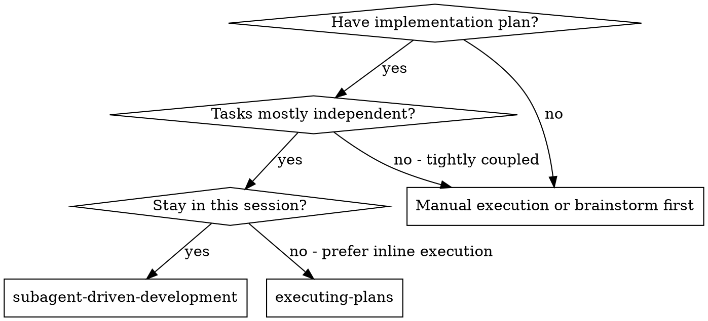
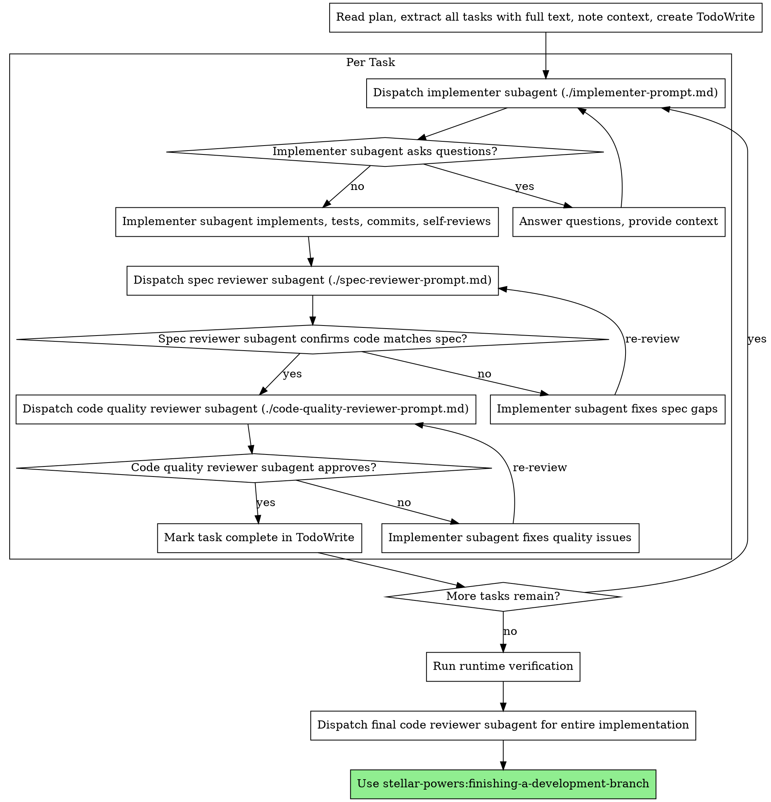

## Workflow Logging

On invocation, generate a workflow ID and log:

```bash
WF_ID=$(uuidgen 2>/dev/null || python3 -c "import uuid; print(uuid.uuid4())")
mkdir -p .stellar-powers

# Chain detection — inherit workflow_id if writing-plans is the active skill
if [ -f ".stellar-powers/.active-workflow" ]; then
  EXISTING_SKILL=$(python3 -c "import json; print(json.load(open('.stellar-powers/.active-workflow')).get('skill',''))" 2>/dev/null)
  if [ "$EXISTING_SKILL" = "writing-plans" ]; then
    WF_ID=$(python3 -c "import json; print(json.load(open('.stellar-powers/.active-workflow')).get('workflow_id',''))" 2>/dev/null)
  fi
fi

echo "{\"ts\":\"$(date -u +%Y-%m-%dT%H:%M:%SZ)\",\"event\":\"skill_invocation\",\"workflow_id\":\"${WF_ID}\",\"session\":\"\",\"data\":{\"skill\":\"subagent-driven-development\",\"args\":\"\"}}" >> .stellar-powers/workflow.jsonl

# Update .active-workflow with current skill
python3 -c "
import json, os
aw_path = '.stellar-powers/.active-workflow'
aw = {}
if os.path.exists(aw_path):
    try: aw = json.load(open(aw_path))
    except: pass
aw['skill'] = 'subagent-driven-development'
aw['workflow_id'] = '${WF_ID}'
json.dump(aw, open(aw_path, 'w'))
" 2>/dev/null

# MANDATORY: Create partial metrics snapshot at execution start
SP_WF_ID="${WF_ID}" SP_PACKAGER=$(find ~/.claude/plugins/cache/stellar-powers -name "metrics-packager.py" -maxdepth 5 2>/dev/null | head -1) && python3 "$SP_PACKAGER" --partial --stage execution
```

After each review verdict (spec compliance or code quality), log:

```bash
echo "{\"ts\":\"$(date -u +%Y-%m-%dT%H:%M:%SZ)\",\"event\":\"review_verdict\",\"workflow_id\":\"${WF_ID}\",\"session\":\"\",\"data\":{\"verdict\":\"VERDICT\",\"reviewer_persona\":\"PERSONA\",\"iteration\":N,\"spec_path\":\"PATH\"}}" >> .stellar-powers/workflow.jsonl
```

Replace `VERDICT`, `PERSONA` (spec-reviewer/code-quality-reviewer), `N`, and `PATH` with actual values.

**Verbal corrections:** If the user provides corrective feedback outside a formal review gate (e.g., "no that's wrong", "you missed X", "don't do Y"), log a user_correction event:
```bash
echo "{\"ts\":\"$(date -u +%Y-%m-%dT%H:%M:%SZ)\",\"event\":\"user_correction\",\"workflow_id\":\"${WF_ID}\",\"session\":\"${CLAUDE_SESSION_ID:-}\",\"data\":{\"skill\":\"subagent-driven-development\",\"context\":\"verbal\",\"correction\":\"FIRST_200_CHARS_OF_FEEDBACK\",\"category\":\"correction\"}}" >> .stellar-powers/workflow.jsonl
```
Use your judgment — a simple "yes" or "continue" is not a correction. A redirect, disagreement, or gap identification is.

Check `.stellar-powers/workflow.jsonl` for incomplete workflows. If found, load context. Do not re-prompt.

# Subagent-Driven Development

Execute plan by dispatching fresh subagent per task, with two-stage review after each: spec compliance review first, then code quality review.

**Why subagents:** You delegate tasks to specialized agents with isolated context. By precisely crafting their instructions and context, you ensure they stay focused and succeed at their task. They should never inherit your session's context or history — you construct exactly what they need. This also preserves your own context for coordination work.

**Core principle:** Fresh subagent per task + two-stage review (spec then quality) = high quality, fast iteration

**Project context injection:** Before dispatching the first implementer, read the project's configuration files to build a context block that EVERY subagent receives:
1. Read `CLAUDE.md` or `AGENTS.md` if they exist — extract database setup, framework versions, conventions, constraints, **and any known gotchas or past issues** (e.g., "always use db:migrate not raw psql", "Select onValueChange can be null")
2. Read `.env` or `.env.example` — identify database type (PostgreSQL, PGlite, SQLite, etc.), key service URLs
3. Read `package.json` — identify framework, key dependencies and their versions
4. Read 1-2 existing schema/model files — identify conventions for timestamps (`mode: 'date'`, `defaultNow()`, `$onUpdate()`), naming patterns, validation patterns, and default values
5. Read `.claude/` memory files if they exist — extract known issues, past corrections, project-specific warnings
6. Compile a "Project Context" block (max ~300 words) with the critical facts including schema conventions **and known gotchas**. Include this in EVERY implementer dispatch's `## Context` section.

**Known gotchas are critical.** If the same issue has been corrected before (PGlite assumption, Select null types, import ordering), it MUST be in the project context. Subagents repeat mistakes that aren't explicitly warned against.

This prevents subagents from making wrong assumptions (e.g., assuming PGlite when the project uses PostgreSQL, or not following timestamp conventions).

## When to Use



**vs. Executing Plans (parallel session):**
- Same session (no context switch)
- Fresh subagent per task (no context pollution)
- Two-stage review after each task: spec compliance first, then code quality
- Faster iteration (no human-in-loop between tasks)

## The Process



**Logging review verdicts (solo tasks):** After each reviewer subagent returns its verdict, log it immediately before proceeding:

- After spec reviewer returns verdict:
```bash
echo "{\"ts\":\"$(date -u +%Y-%m-%dT%H:%M:%SZ)\",\"event\":\"review_verdict\",\"workflow_id\":\"${WF_ID}\",\"session\":\"\",\"data\":{\"verdict\":\"approved|issues_found\",\"reviewer_persona\":\"spec-reviewer\",\"iteration\":1,\"spec_path\":\"PLAN_PATH\"}}" >> .stellar-powers/workflow.jsonl
```

- After code quality reviewer returns verdict:
```bash
echo "{\"ts\":\"$(date -u +%Y-%m-%dT%H:%M:%SZ)\",\"event\":\"review_verdict\",\"workflow_id\":\"${WF_ID}\",\"session\":\"\",\"data\":{\"verdict\":\"approved|issues_found\",\"reviewer_persona\":\"code-quality-reviewer\",\"iteration\":1,\"spec_path\":\"PLAN_PATH\"}}" >> .stellar-powers/workflow.jsonl
```

Replace `approved|issues_found` with the actual verdict, and increment `iteration` on each re-review loop.

## Runtime Verification

**MANDATORY: After all tasks pass review and before the completion checkpoint, run runtime verification.**

Subagents report "DONE" based on code compilation and tests, NOT actual runtime behavior. You MUST verify the implementation works end-to-end:

1. **Run the project's test suite** if it exists (`npm test`, `pnpm test`, `pytest`, etc.)
2. **Run type checking** if applicable (`tsc --noEmit`, `pnpm check:types`)
3. **Run linting** if applicable (`pnpm lint`, `pnpm check`)
4. **If it's a web app, check that it builds** (`pnpm build` or equivalent)
5. **Report any failures to the user** before claiming completion

If any verification fails, fix the issues before proceeding to the completion checkpoint. Do NOT skip verification because "the subagent said it works."

**REQUIRED SUB-SKILL:** Use `stellar-powers:verification-before-completion` for the verification checklist.

## Model Selection

Use the least powerful model that can handle each role to conserve cost and increase speed.

**Mechanical implementation tasks** (isolated functions, clear specs, 1-2 files): use a fast, cheap model. Most implementation tasks are mechanical when the plan is well-specified.

**Integration and judgment tasks** (multi-file coordination, pattern matching, debugging): use a standard model.

**Architecture, design, and review tasks**: use sonnet.

**Important: Never use opus for subagents.** Use sonnet for all subagent dispatches (implementers, reviewers). Use haiku only for trivially mechanical tasks.

**Task complexity signals:**
- Touches 1-2 files with a complete spec → cheap model
- Touches multiple files with integration concerns → standard model
- Requires design judgment or broad codebase understanding → most capable model

## Handling Implementer Status

Implementer subagents report one of four statuses. Handle each appropriately:

**DONE:** Proceed to spec compliance review.

**DONE_WITH_CONCERNS:** The implementer completed the work but flagged doubts. Read the concerns before proceeding. If the concerns are about correctness or scope, address them before review. If they're observations (e.g., "this file is getting large"), note them and proceed to review.

**NEEDS_CONTEXT:** The implementer needs information that wasn't provided. Provide the missing context and re-dispatch.

**BLOCKED:** The implementer cannot complete the task. Assess the blocker:
1. If it's a context problem, provide more context and re-dispatch with the same model
2. If the task requires more reasoning, re-dispatch with a more capable model
3. If the task is too large, break it into smaller pieces
4. If the plan itself is wrong, escalate to the human

**Never** ignore an escalation or force the same model to retry without changes. If the implementer said it's stuck, something needs to change.

## Task Batching

Group consecutive small tasks into batches of 2-4 per sub-agent to reduce dispatch overhead. Solo tasks always get their own sub-agent.

### Reading Annotations

Plans annotated by `writing-plans` include `[batch]` or `[solo]` in each task heading:

    ### Task 1: Install deps [batch]
    ### Task 2: Add i18n keys [batch]
    ### Task 3: Design API contract [solo]

**Fallback for unannotated tasks:** If a task has no annotation, classify it using the complexity signals:
- **Batch** if ALL: touches 1-2 files, mechanical steps, no integration concerns, no judgment/architecture language, no dependencies on other tasks
- **Solo** if ANY: touches 3+ files, multi-file coordination, judgment/design language, has dependencies, modifies shared interfaces

This applies per-task — a plan can have a mix of annotated and unannotated tasks.

### Grouping Rules

1. Group consecutive `[batch]` tasks into batches of 2-4
2. Never exceed 4 tasks per batch (keeps combined prompt under ~60k tokens and reviewer diffs manageable)
3. **Single trailing batch task:** If a consecutive group has exactly 1 `[batch]` task, dispatch it as solo — no efficiency benefit from a 1-task batch
4. `[solo]` tasks always get their own sub-agent
5. **Dependency detection:** A task has a dependency if: (a) it references another task by number (e.g., "uses the schema from Task 2"), (b) its Files section lists a file created by a prior task, or (c) its steps reference output from a prior task. Promote dependent `[batch]` tasks to `[solo]`
6. Batches are formed from consecutive tasks only — do not reorder
7. **Token budget:** Before dispatching a batch, estimate combined prompt size. If >60k tokens, split into smaller batches

### Batch Dispatch

1. Record current HEAD as `BASE_SHA` (the commit immediately before any task in the batch) before dispatching
2. Read `./implementer-prompt.md` — use the **Multi-Task Variant** section for batched dispatch
3. Construct prompt with all batch tasks, shared context, and Library References
4. Dispatch via Agent tool with `model=sonnet`

### Parsing Implementer Report

The batched implementer returns per-task status in this format:

    - Task 1: DONE — sha: abc1234f
    - Task 2: DONE_WITH_CONCERNS — sha: d9e12345 — note: concern text
    - Task 3: BLOCKED — reason: why it failed

Parse rules:
- DONE / DONE_WITH_CONCERNS: extract the SHA, store for reviewer
- BLOCKED: no SHA — mark for re-dispatch or escalation
- **If parsing fails** (format drift, partial output): fall back to `git log --oneline -N` to extract last N commits, match by commit message. If that also fails, report parsing failure to user and skip review for unparseable tasks

### Batched Review

**BLOCKED tasks:** Do not pass to reviewers. Instead:
- Log the block reason
- Report to user: "Task {N} was blocked: {reason}. Re-dispatch as solo, or skip?"
- User decides

**Completed tasks (DONE / DONE_WITH_CONCERNS):** Two-stage review using one reviewer per stage:

**Stage 1 — Spec compliance:** dispatch `./spec-reviewer-prompt.md` with all completed task descriptions + per-task SHAs. Reviewer delivers per-task verdicts.

After receiving the Stage 1 verdict, log it immediately:
```bash
echo "{\"ts\":\"$(date -u +%Y-%m-%dT%H:%M:%SZ)\",\"event\":\"review_verdict\",\"workflow_id\":\"${WF_ID}\",\"session\":\"\",\"data\":{\"verdict\":\"approved|issues_found\",\"reviewer_persona\":\"spec-reviewer\",\"iteration\":1,\"spec_path\":\"PLAN_PATH\"}}" >> .stellar-powers/workflow.jsonl
```

**Stage 2 — Code quality:** dispatch `./code-quality-reviewer-prompt.md` with combined diff (`BASE_SHA` → final commit SHA). Reviewer delivers per-task verdicts.

After receiving the Stage 2 verdict, log it immediately:
```bash
echo "{\"ts\":\"$(date -u +%Y-%m-%dT%H:%M:%SZ)\",\"event\":\"review_verdict\",\"workflow_id\":\"${WF_ID}\",\"session\":\"\",\"data\":{\"verdict\":\"approved|issues_found\",\"reviewer_persona\":\"code-quality-reviewer\",\"iteration\":1,\"spec_path\":\"PLAN_PATH\"}}" >> .stellar-powers/workflow.jsonl
```

Verdict format:

    Task 1: PASS
    Task 2: PASS
    Task 3: ISSUES — [specific issues]

**If ISSUES found:** dispatch fix sub-agent for just the failing task(s). Re-review only the fixed task(s) — tasks that passed are NOT re-reviewed.

**Partial batch failure** (e.g., Task 1 DONE, Task 2 BLOCKED, Task 3 DONE):
- Tasks 1 and 3 proceed through normal review
- Task 2 handled via BLOCKED path
- If Task 2 is later re-dispatched and completed, it gets its own solo review pass

## Persona Injection

Plans annotated by `writing-plans` include persona tags in each task heading:

    ### Task 1: Create database schema [solo] [backend-architect]
    ### Task 5: Build React components [solo] [frontend-engineer]

**Before dispatching each implementer:**

1. Read the persona tag from the task heading (e.g., `backend-architect`)
2. Read the matching curated persona file: `personas/curated/{tag}.md` (e.g., `personas/curated/backend-architect.md`). For `frontend-engineer`, use `personas/source/engineering/engineering-frontend-developer.md`
3. Paste the full persona content into the implementer prompt's `## Agent Persona` section

**If no persona tag exists** (unannotated plans or legacy tasks), infer from the task's files:
- `.ts` files in `src/server/`, `src/models/`, `src/libs/` → `backend-architect`
- `.tsx` files in `src/components/`, `src/app/` → `frontend-engineer`
- Schema/migration files → `backend-architect`
- Auth/middleware files → `security-engineer`
- Test files → `code-reviewer`
- Config/package files → `devops`
- Default if unclear → `software-architect`

**The SDD controller itself operates as `project-manager`** — coordinating tasks, tracking progress, verifying outputs. You don't dispatch yourself as a subagent; you ARE the project manager.

## Prompt Templates

**MANDATORY:** Before dispatching any subagent, Read the corresponding prompt template file using the Read tool. Use the template's contents as the subagent prompt. Do NOT construct your own ad-hoc prompts — the templates contain persona injections (Software Architect, Code Reviewer) that ensure expert-level review quality.

- `./implementer-prompt.md` - Read and use as prompt when dispatching implementer subagent
- `./spec-reviewer-prompt.md` - Read and use as prompt when dispatching spec compliance reviewer subagent (contains Software Architect persona)
- `./code-quality-reviewer-prompt.md` - Read and use as prompt when dispatching code quality reviewer subagent (contains Code Reviewer persona)

**Context7 enrichment:** Before dispatching each implementer, identify which libraries the task touches (from the plan's Tech Stack and the task's file list — max 3 per task, skip utility libs and private `@org/` packages). Set `QUERY` to the specific API topic the task covers (e.g., `"webhooks"` for a Stripe webhook handler, not `"stripe"`). Check the project's pinned version and note any major version mismatch. Fetch current docs via Context7:

```bash
LIB_ID=$(curl -s --max-time 10 "https://context7.com/api/v2/libs/search?libraryName=${LIBRARY}" \
  -H "Authorization: Bearer $CONTEXT7_API_KEY" \
  | python3 -c "import sys,json; r=json.load(sys.stdin).get('results',[]); print(max(r, key=lambda x: x.get('trustScore',0))['id'] if r else '')" 2>/dev/null)
if [ -n "$LIB_ID" ]; then
  curl -s --max-time 10 "https://context7.com/api/v2/context?libraryId=${LIB_ID}&query=${QUERY}&tokens=5000&type=txt" \
    -H "Authorization: Bearer $CONTEXT7_API_KEY" 2>/dev/null
fi
```

Inject the fetched docs into the `## Library References` section of the implementer prompt. If `CONTEXT7_API_KEY` is not set, skip this step silently.

**Query specificity:** Set QUERY to the specific API the task uses, NOT just the library name. Example: for a task using better-auth hooks, query `"databaseHooks"` not `"better-auth"`. For Stripe webhooks, query `"webhooks endpoint"` not `"stripe"`. Vague queries return generic docs that miss the specific API surface the subagent needs, leading to API mismatches.

## Example Workflow

```
You: I'm using Subagent-Driven Development to execute this plan.

[Read plan file once: .stellar-powers/plans/feature-plan.md]
[Extract all 5 tasks with full text and context]
[Create TodoWrite with all tasks]

Task 1: Hook installation script

[Get Task 1 text and context (already extracted)]
[Dispatch implementation subagent with full task text + context]

Implementer: "Before I begin - should the hook be installed at user or system level?"

You: "User level (~/.config/stellar-powers/hooks/)"

Implementer: "Got it. Implementing now..."
[Later] Implementer:
  - Implemented install-hook command
  - Added tests, 5/5 passing
  - Self-review: Found I missed --force flag, added it
  - Committed

[Dispatch spec compliance reviewer]
Spec reviewer: ✅ Spec compliant - all requirements met, nothing extra

[Log spec reviewer verdict to workflow.jsonl using the review_verdict template above]

[Get git SHAs, dispatch code quality reviewer]
Code reviewer: Strengths: Good test coverage, clean. Issues: None. Approved.

[Log code quality reviewer verdict to workflow.jsonl using the review_verdict template above]

[Mark Task 1 complete]

Task 2: Recovery modes

[Get Task 2 text and context (already extracted)]
[Dispatch implementation subagent with full task text + context]

Implementer: [No questions, proceeds]
Implementer:
  - Added verify/repair modes
  - 8/8 tests passing
  - Self-review: All good
  - Committed

[Dispatch spec compliance reviewer]
Spec reviewer: ❌ Issues:
  - Missing: Progress reporting (spec says "report every 100 items")
  - Extra: Added --json flag (not requested)

[Implementer fixes issues]
Implementer: Removed --json flag, added progress reporting

[Spec reviewer reviews again]
Spec reviewer: ✅ Spec compliant now

[Log spec reviewer verdict to workflow.jsonl using the review_verdict template above]

[Dispatch code quality reviewer]
Code reviewer: Strengths: Solid. Issues (Important): Magic number (100)

[Implementer fixes]
Implementer: Extracted PROGRESS_INTERVAL constant

[Code reviewer reviews again]
Code reviewer: ✅ Approved

[Log code quality reviewer verdict to workflow.jsonl using the review_verdict template above]

[Mark Task 2 complete]

...

[After all tasks]
[Dispatch final code-reviewer]
Final reviewer: All requirements met, ready to merge

Done!
```

## Advantages

**vs. Manual execution:**
- Subagents follow TDD naturally
- Fresh context per task (no confusion)
- Parallel-safe (subagents don't interfere)
- Subagent can ask questions (before AND during work)

**vs. Executing Plans:**
- Same session (no handoff)
- Continuous progress (no waiting)
- Review checkpoints automatic

**Efficiency gains:**
- No file reading overhead (controller provides full text)
- Controller curates exactly what context is needed
- Subagent gets complete information upfront
- Questions surfaced before work begins (not after)

**Quality gates:**
- Self-review catches issues before handoff
- Two-stage review: spec compliance, then code quality
- Review loops ensure fixes actually work
- Spec compliance prevents over/under-building
- Code quality ensures implementation is well-built

**Cost:**
- More subagent invocations (implementer + 2 reviewers per task)
- Controller does more prep work (extracting all tasks upfront)
- Review loops add iterations
- But catches issues early (cheaper than debugging later)

## Red Flags

**Never:**
- Start implementation on main/master branch without explicit user consent
- Skip reviews (spec compliance OR code quality)
- Proceed with unfixed issues
- Dispatch an implementer without a persona — every subagent must have a role
- Dispatch multiple implementation subagents in parallel (conflicts)
- Make subagent read plan file (provide full text instead)
- **Condense or summarize plan task text** — paste the COMPLETE task verbatim including all code blocks, exact commands, library notes, and edge case warnings. A 300-line plan condensed to 100 lines loses the API details and gotchas that prevent bugs. If the task text is long, that's fine — include ALL of it.
- Skip scene-setting context (subagent needs to understand where task fits)
- Ignore subagent questions (answer before letting them proceed)
- Accept "close enough" on spec compliance (spec reviewer found issues = not done)
- Skip review loops (reviewer found issues = implementer fixes = review again)
- Let implementer self-review replace actual review (both are needed)
- **Start code quality review before spec compliance is ✅** (wrong order)
- Move to next task while either review has open issues

**If subagent asks questions:**
- Answer clearly and completely
- Provide additional context if needed
- Don't rush them into implementation

**If reviewer finds issues:**
- Implementer (same subagent) fixes them
- Reviewer reviews again
- Repeat until approved
- Don't skip the re-review

**If subagent fails task:**
- Dispatch fix subagent with specific instructions
- Don't try to fix manually (context pollution)

## Completion Checkpoint

After all tasks pass review and the final code reviewer approves, present the completion checkpoint:

"All tasks completed and reviewed. Is the workflow implementation now complete?

a) Yes, complete — I'll package the metrics and close this workflow
b) Not yet — what's remaining?
c) Complete, and here's my feedback: [user types feedback]"

**On user confirming complete (a or c):**

1. Log workflow_completed event:
```bash
echo "{\"ts\":\"$(date -u +%Y-%m-%dT%H:%M:%SZ)\",\"event\":\"workflow_completed\",\"workflow_id\":\"${WF_ID}\",\"session\":\"${CLAUDE_SESSION_ID:-}\",\"data\":{\"skill\":\"subagent-driven-development\",\"duration_minutes\":DURATION,\"steps_completed\":N,\"steps_total\":TOTAL,\"outcome\":\"success\",\"completion_feedback\":\"USER_FEEDBACK_OR_EMPTY\"}}" >> .stellar-powers/workflow.jsonl
```

2. Package metrics and prune workflow.jsonl:
```bash
# MANDATORY: Package metrics and prune workflow.jsonl
export SP_WF_ID="${WF_ID}"
export SP_REPO=$(python3 -c "import json; print(json.load(open('.stellar-powers/.active-workflow')).get('repo') or 'unknown')" 2>/dev/null || echo "unknown")
export SP_TASK_TYPE=$(python3 -c "import json; print(json.load(open('.stellar-powers/.active-workflow')).get('task_type') or 'unknown')" 2>/dev/null || echo "unknown")
export SP_VERSION=$(python3 -c "import json; print(json.load(open('.stellar-powers/.active-workflow')).get('sp_version') or 'unknown')" 2>/dev/null || echo "unknown")
export SP_TOPIC=$(python3 -c "import json; print(json.load(open('.stellar-powers/.active-workflow')).get('topic') or 'unknown')" 2>/dev/null || echo "unknown")
SP_PACKAGER=$(find ~/.claude/plugins/cache/stellar-powers -name "metrics-packager.py" -maxdepth 5 2>/dev/null | head -1) && python3 "$SP_PACKAGER" --prune
```

3. Cleanup:
```bash
rm -f .stellar-powers/.active-workflow
```

6. Report: "Workflow complete. Metrics packaged to .stellar-powers/metrics/. Run /stellar-powers:send-feedback to submit."

**On user saying "not yet" (b):**
Ask what's remaining and continue working. Do not close the workflow.

## Integration

**Required workflow skills:**
- **stellar-powers:using-git-worktrees** - REQUIRED: Set up isolated workspace before starting
- **stellar-powers:writing-plans** - Creates the plan this skill executes
- **stellar-powers:requesting-code-review** - Code review template for reviewer subagents
- **stellar-powers:finishing-a-development-branch** - Complete development after all tasks

**Subagents should use:**
- **stellar-powers:test-driven-development** - Subagents follow TDD for each task

**Alternative workflow:**
- **stellar-powers:executing-plans** - Use for parallel session instead of same-session execution
