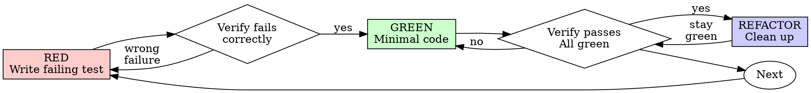

## Workflow Logging

On invocation, generate a workflow ID and log:

```bash
WF_ID=$(uuidgen 2>/dev/null || python3 -c "import uuid; print(uuid.uuid4())")
mkdir -p .stellar-powers

# Chain detection — inherit workflow_id from any existing active workflow
if [ -f ".stellar-powers/.active-workflow" ]; then
  WF_ID=$(python3 -c "import json; print(json.load(open('.stellar-powers/.active-workflow')).get('workflow_id',''))" 2>/dev/null)
fi

echo "{\"ts\":\"$(date -u +%Y-%m-%dT%H:%M:%SZ)\",\"event\":\"skill_invocation\",\"workflow_id\":\"${WF_ID}\",\"session\":\"\",\"data\":{\"skill\":\"test-driven-development\",\"args\":\"\"}}" >> .stellar-powers/workflow.jsonl

# Update .active-workflow with current skill
python3 -c "
import json, os
aw_path = '.stellar-powers/.active-workflow'
aw = {}
if os.path.exists(aw_path):
    try: aw = json.load(open(aw_path))
    except: pass
aw['skill'] = 'test-driven-development'
aw['workflow_id'] = '${WF_ID}'
json.dump(aw, open(aw_path, 'w'))
" 2>/dev/null
```

# Test-Driven Development (TDD)

## Overview

Write the test first. Watch it fail. Write minimal code to pass.

**Core principle:** If you didn't watch the test fail, you don't know if it tests the right thing.

**Violating the letter of the rules is violating the spirit of the rules.**

## When to Use

**Always:**
- New features
- Bug fixes
- Refactoring
- Behavior changes

**Exceptions (ask your human partner):**
- Throwaway prototypes
- Generated code
- Configuration files

Thinking "skip TDD just this once"? Stop. That's rationalization.

## The Iron Law

```
NO PRODUCTION CODE WITHOUT A FAILING TEST FIRST
```

Write code before the test? Delete it. Start over.

**No exceptions:**
- Don't keep it as "reference"
- Don't "adapt" it while writing tests
- Don't look at it
- Delete means delete

Implement fresh from tests. Period.

## Red-Green-Refactor



### RED - Write Failing Test

Write one minimal test showing what should happen.

<Good>
```typescript
test('retries failed operations 3 times', async () => {
  let attempts = 0;
  const operation = () => {
    attempts++;
    if (attempts < 3) throw new Error('fail');
    return 'success';
  };

  const result = await retryOperation(operation);

  expect(result).toBe('success');
  expect(attempts).toBe(3);
});
```
Clear name, tests real behavior, one thing
</Good>

<Bad>
```typescript
test('retry works', async () => {
  const mock = jest.fn()
    .mockRejectedValueOnce(new Error())
    .mockRejectedValueOnce(new Error())
    .mockResolvedValueOnce('success');
  await retryOperation(mock);
  expect(mock).toHaveBeenCalledTimes(3);
});
```
Vague name, tests mock not code
</Bad>

**Requirements:**
- One behavior
- Clear name
- Real code (no mocks unless unavoidable)

### Verify RED - Watch It Fail

**MANDATORY. Never skip.**

```bash
npm test path/to/test.test.ts
```

Confirm:
- Test fails (not errors)
- Failure message is expected
- Fails because feature missing (not typos)

**Test passes?** You're testing existing behavior. Fix test.

**Test errors?** Fix error, re-run until it fails correctly.

### GREEN - Minimal Code

Write simplest code to pass the test.

<Good>
```typescript
async function retryOperation<T>(fn: () => Promise<T>): Promise<T> {
  for (let i = 0; i < 3; i++) {
    try {
      return await fn();
    } catch (e) {
      if (i === 2) throw e;
    }
  }
  throw new Error('unreachable');
}
```
Just enough to pass
</Good>

<Bad>
```typescript
async function retryOperation<T>(
  fn: () => Promise<T>,
  options?: {
    maxRetries?: number;
    backoff?: 'linear' | 'exponential';
    onRetry?: (attempt: number) => void;
  }
): Promise<T> {
  // YAGNI
}
```
Over-engineered
</Bad>

Don't add features, refactor other code, or "improve" beyond the test.

### Verify GREEN - Watch It Pass

**MANDATORY.**

```bash
npm test path/to/test.test.ts
```

Confirm:
- Test passes
- Other tests still pass
- Output pristine (no errors, warnings)

**Test fails?** Fix code, not test.

**Other tests fail?** Fix now.

### REFACTOR - Clean Up

After green only:
- Remove duplication
- Improve names
- Extract helpers

Keep tests green. Don't add behavior.

### Repeat

Next failing test for next feature.

## Good Tests

| Quality | Good | Bad |
|---------|------|-----|
| **Minimal** | One thing. "and" in name? Split it. | `test('validates email and domain and whitespace')` |
| **Clear** | Name describes behavior | `test('test1')` |
| **Shows intent** | Demonstrates desired API | Obscures what code should do |

## Why Order Matters

**"I'll write tests after to verify it works"**

Tests written after code pass immediately. Passing immediately proves nothing:
- Might test wrong thing
- Might test implementation, not behavior
- Might miss edge cases you forgot
- You never saw it catch the bug

Test-first forces you to see the test fail, proving it actually tests something.

**"I already manually tested all the edge cases"**

Manual testing is ad-hoc. You think you tested everything but:
- No record of what you tested
- Can't re-run when code changes
- Easy to forget cases under pressure
- "It worked when I tried it" ≠ comprehensive

Automated tests are systematic. They run the same way every time.

**"Deleting X hours of work is wasteful"**

Sunk cost fallacy. The time is already gone. Your choice now:
- Delete and rewrite with TDD (X more hours, high confidence)
- Keep it and add tests after (30 min, low confidence, likely bugs)

The "waste" is keeping code you can't trust. Working code without real tests is technical debt.

**"TDD is dogmatic, being pragmatic means adapting"**

TDD IS pragmatic:
- Finds bugs before commit (faster than debugging after)
- Prevents regressions (tests catch breaks immediately)
- Documents behavior (tests show how to use code)
- Enables refactoring (change freely, tests catch breaks)

"Pragmatic" shortcuts = debugging in production = slower.

**"Tests after achieve the same goals - it's spirit not ritual"**

No. Tests-after answer "What does this do?" Tests-first answer "What should this do?"

Tests-after are biased by your implementation. You test what you built, not what's required. You verify remembered edge cases, not discovered ones.

Tests-first force edge case discovery before implementing. Tests-after verify you remembered everything (you didn't).

30 minutes of tests after ≠ TDD. You get coverage, lose proof tests work.

## Common Rationalizations

| Excuse | Reality |
|--------|---------|
| "Too simple to test" | Simple code breaks. Test takes 30 seconds. |
| "I'll test after" | Tests passing immediately prove nothing. |
| "Tests after achieve same goals" | Tests-after = "what does this do?" Tests-first = "what should this do?" |
| "Already manually tested" | Ad-hoc ≠ systematic. No record, can't re-run. |
| "Deleting X hours is wasteful" | Sunk cost fallacy. Keeping unverified code is technical debt. |
| "Keep as reference, write tests first" | You'll adapt it. That's testing after. Delete means delete. |
| "Need to explore first" | Fine. Throw away exploration, start with TDD. |
| "Test hard = design unclear" | Listen to test. Hard to test = hard to use. |
| "TDD will slow me down" | TDD faster than debugging. Pragmatic = test-first. |
| "Manual test faster" | Manual doesn't prove edge cases. You'll re-test every change. |
| "Existing code has no tests" | You're improving it. Add tests for existing code. |

## Red Flags - STOP and Start Over

- Code before test
- Test after implementation
- Test passes immediately
- Can't explain why test failed
- Tests added "later"
- Rationalizing "just this once"
- "I already manually tested it"
- "Tests after achieve the same purpose"
- "It's about spirit not ritual"
- "Keep as reference" or "adapt existing code"
- "Already spent X hours, deleting is wasteful"
- "TDD is dogmatic, I'm being pragmatic"
- "This is different because..."

**All of these mean: Delete code. Start over with TDD.**

## Example: Bug Fix

**Bug:** Empty email accepted

**RED**
```typescript
test('rejects empty email', async () => {
  const result = await submitForm({ email: '' });
  expect(result.error).toBe('Email required');
});
```

**Verify RED**
```bash
$ npm test
FAIL: expected 'Email required', got undefined
```

**GREEN**
```typescript
function submitForm(data: FormData) {
  if (!data.email?.trim()) {
    return { error: 'Email required' };
  }
  // ...
}
```

**Verify GREEN**
```bash
$ npm test
PASS
```

**REFACTOR**
Extract validation for multiple fields if needed.

## Verification Checklist

Before marking work complete:

- [ ] Every new function/method has a test
- [ ] Watched each test fail before implementing
- [ ] Each test failed for expected reason (feature missing, not typo)
- [ ] Wrote minimal code to pass each test
- [ ] All tests pass
- [ ] Output pristine (no errors, warnings)
- [ ] Tests use real code (mocks only if unavoidable)
- [ ] Edge cases and errors covered

Can't check all boxes? You skipped TDD. Start over.

## When Stuck

| Problem | Solution |
|---------|----------|
| Don't know how to test | Write wished-for API. Write assertion first. Ask your human partner. |
| Test too complicated | Design too complicated. Simplify interface. |
| Must mock everything | Code too coupled. Use dependency injection. |
| Test setup huge | Extract helpers. Still complex? Simplify design. |

## Debugging Integration

Bug found? Write failing test reproducing it. Follow TDD cycle. Test proves fix and prevents regression.

Never fix bugs without a test.

## Testing Anti-Patterns

When adding mocks or test utilities, read `./testing-anti-patterns.md` to avoid common pitfalls:
- Testing mock behavior instead of real behavior
- Adding test-only methods to production classes
- Mocking without understanding dependencies

## Final Rule

```
Production code → test exists and failed first
Otherwise → not TDD
```

No exceptions without your human partner's permission.

## Completion Checkpoint

After all tests pass and implementation is complete, present the completion checkpoint:

"All tasks completed and reviewed. Is the workflow implementation now complete?

a) Yes, complete — I'll package the metrics and close this workflow
b) Not yet — what's remaining?
c) Complete, and here's my feedback: [user types feedback]"

**On user confirming complete (a or c):**

1. Log workflow_completed event:
```bash
echo "{\"ts\":\"$(date -u +%Y-%m-%dT%H:%M:%SZ)\",\"event\":\"workflow_completed\",\"workflow_id\":\"${WF_ID}\",\"session\":\"${CLAUDE_SESSION_ID:-}\",\"data\":{\"skill\":\"test-driven-development\",\"duration_minutes\":DURATION,\"steps_completed\":N,\"steps_total\":TOTAL,\"outcome\":\"success\",\"completion_feedback\":\"USER_FEEDBACK_OR_EMPTY\"}}" >> .stellar-powers/workflow.jsonl
```

2. Export env vars from .active-workflow:
```bash
export SP_WF_ID="${WF_ID}"
export SP_REPO=$(python3 -c "import json; print(json.load(open('.stellar-powers/.active-workflow')).get('repo','unknown'))" 2>/dev/null || echo "unknown")
export SP_TASK_TYPE=$(python3 -c "import json; print(json.load(open('.stellar-powers/.active-workflow')).get('task_type','unknown'))" 2>/dev/null || echo "unknown")
export SP_VERSION=$(python3 -c "import json; print(json.load(open('.stellar-powers/.active-workflow')).get('sp_version','unknown'))" 2>/dev/null || echo "unknown")
export SP_TOPIC=$(python3 -c "import json; print(json.load(open('.stellar-powers/.active-workflow')).get('topic','unknown'))" 2>/dev/null || echo "unknown")
```

3. Package metrics:
```bash
python3 << 'PYEOF'
import json, os, sys
from datetime import datetime

cwd = os.getcwd()
wf_file = os.path.join(cwd, ".stellar-powers", "workflow.jsonl")
wf_id = os.environ.get("SP_WF_ID", "")
if not wf_id:
    print("ERROR: SP_WF_ID not set", file=sys.stderr)
    sys.exit(1)

events = []
with open(wf_file) as f:
    for line in f:
        line = line.strip()
        if not line:
            continue
        try:
            evt = json.loads(line)
            if evt.get("workflow_id") == wf_id:
                events.append(evt)
        except:
            continue

aw_path = os.path.join(cwd, ".stellar-powers", ".active-workflow")
aw = {}
if os.path.exists(aw_path):
    try:
        aw = json.load(open(aw_path))
    except:
        pass

repo = os.environ.get("SP_REPO") or aw.get("repo", "unknown")
task_type = os.environ.get("SP_TASK_TYPE") or aw.get("task_type", "unknown")
sp_version = os.environ.get("SP_VERSION") or aw.get("sp_version", "unknown")
topic = os.environ.get("SP_TOPIC") or aw.get("topic", "unknown")

started = ""
completed = ""
duration = 0
completion_feedback = ""
outcome = "unknown"
for e in events:
    if e.get("event") == "skill_invocation" and not started:
        started = e.get("ts", "")
    if e.get("event") == "workflow_completed":
        completed = e.get("ts", "")
        d = e.get("data", {})
        duration = d.get("duration_minutes", 0)
        completion_feedback = d.get("completion_feedback", "")
        outcome = d.get("outcome", "success")

if started and completed:
    try:
        start_dt = datetime.fromisoformat(started.replace('Z', '+00:00'))
        end_dt = datetime.fromisoformat(completed.replace('Z', '+00:00'))
        duration = int((end_dt - start_dt).total_seconds() / 60)
    except Exception:
        duration = 0

skills_seen = []
for e in events:
    if e.get("event") == "skill_invocation":
        s = e.get("data", {}).get("skill", "")
        if s and s not in skills_seen:
            skills_seen.append(s)

skills_data = {}
for skill in skills_seen:
    skill_events = [e for e in events if e.get("data", {}).get("skill") == skill]
    steps_completed = sum(1 for e in skill_events if e.get("event") == "step_completed")
    steps_total = max([e.get("data", {}).get("step_number", 0) for e in skill_events if e.get("event") in ("step_started", "step_completed")] or [0])
    corrections = [{"step": e["data"].get("context", ""), "feedback": e["data"].get("correction", "")}
                   for e in skill_events if e.get("event") == "user_correction"]
    review_verdicts = [e["data"].get("verdict", "") for e in events
                       if e.get("event") == "review_verdict" and e.get("workflow_id") == wf_id]
    review_iterations = len(review_verdicts)
    violations = {}
    for e in events:
        if e.get("event") == "hook_violation" and e.get("workflow_id") == wf_id:
            vtype = e.get("data", {}).get("type", "unknown")
            violations[vtype] = violations.get(vtype, 0) + 1
    skills_data[skill] = {
        "steps_completed": steps_completed,
        "steps_total": steps_total,
        "corrections": corrections,
        "review_iterations": review_iterations,
        "review_verdicts": review_verdicts,
        "violations": [{"type": k, "count": v} for k, v in violations.items()]
    }

tasks = [{"id": e["data"].get("task_id", ""), "subject": e["data"].get("task_subject", ""), "status": "completed"}
         for e in events if e.get("event") == "task_completed"]
user_messages = [{"timestamp": e.get("ts", ""), "context": f"{e['data'].get('active_skill', '')}/{e['data'].get('active_step', '')}",
                  "preview": e["data"].get("prompt_preview", "")}
                 for e in events if e.get("event") == "user_message"]
ai_responses = [{"timestamp": e.get("ts", ""), "context": e["data"].get("active_skill", ""),
                 "preview": e["data"].get("response_preview", "")}
                for e in events if e.get("event") == "turn_completed"]
tool_failures = [{"tool": e["data"].get("tool_name", ""), "error": e["data"].get("error_preview", "")}
                 for e in events if e.get("event") == "tool_failure"]
artifacts = []
for e in events:
    if e.get("event") in ("spec_created", "plan_created"):
        p = e.get("data", {}).get("path", "")
        if p:
            artifacts.append(p)

package = {
    "package_version": "1.0",
    "workflow_id": wf_id,
    "stellar_powers_version": sp_version,
    "context": {
        "repo": repo,
        "project_type": aw.get("project_type", "unknown"),
        "task_type": task_type,
        "skills_chain": skills_seen
    },
    "timeline": {
        "started": started,
        "completed": completed,
        "duration_minutes": duration,
        "user_confirmed_complete": True
    },
    "skills": skills_data,
    "tasks": tasks,
    "user_messages": user_messages,
    "ai_responses": ai_responses,
    "tool_failures": tool_failures,
    "artifacts": artifacts,
    "completion_feedback": completion_feedback
}

metrics_dir = os.path.join(cwd, ".stellar-powers", "metrics")
os.makedirs(metrics_dir, exist_ok=True)
date_str = datetime.utcnow().strftime("%Y-%m-%d")
pkg_path = os.path.join(metrics_dir, f"{date_str}-{topic}-{wf_id[:8]}.json")
with open(pkg_path, "w") as f:
    json.dump(package, f, indent=2)
with open(pkg_path) as f:
    json.load(f)
print(f"METRICS_PACKAGE={pkg_path}")
PYEOF
```

4. Prune workflow.jsonl:
```bash
python3 << 'PYEOF'
import json, os

cwd = os.getcwd()
wf_file = os.path.join(cwd, ".stellar-powers", "workflow.jsonl")
wf_id = os.environ.get("SP_WF_ID", "")
if not wf_id:
    import sys; print("ERROR: SP_WF_ID not set", file=sys.stderr); sys.exit(1)

kept = []
pruned_events = []

with open(wf_file) as f:
    for line in f:
        line = line.strip()
        if not line:
            continue
        try:
            evt = json.loads(line)
            if evt.get("workflow_id") == wf_id:
                pruned_events.append(evt)
            else:
                kept.append(line)
        except:
            kept.append(line)

skills_seen = []
for e in pruned_events:
    if e.get("event") == "skill_invocation":
        s = e.get("data", {}).get("skill", "")
        if s and s not in skills_seen:
            skills_seen.append(s)

completed_evt = next((e for e in pruned_events if e.get("event") == "workflow_completed"), {})
started_evt = next((e for e in pruned_events if e.get("event") in ("skill_invocation", "workflow_started")), {})

corrections = sum(1 for e in pruned_events if e.get("event") == "user_correction")
review_iters = sum(1 for e in pruned_events if e.get("event") == "review_verdict")
violations = sum(1 for e in pruned_events if e.get("event") == "hook_violation")
tasks_done = sum(1 for e in pruned_events if e.get("event") == "task_completed")
steps_done = sum(1 for e in pruned_events if e.get("event") == "step_completed")
steps_total = max([e.get("data", {}).get("step_number", 0) for e in pruned_events if e.get("event") == "step_started"] or [steps_done])

artifacts = [e.get("data", {}).get("path", "") for e in pruned_events if e.get("event") in ("spec_created", "plan_created") and e.get("data", {}).get("path")]

aw = {}
aw_path = os.path.join(cwd, ".stellar-powers", ".active-workflow")
if os.path.exists(aw_path):
    try: aw = json.load(open(aw_path))
    except: pass

summary = {
    "ts": completed_evt.get("ts", started_evt.get("ts", "")),
    "event": "workflow_summary",
    "workflow_id": wf_id,
    "session": "",
    "data": {
        "skill_chain": skills_seen,
        "topic": os.environ.get("SP_TOPIC") or aw.get("topic", "unknown"),
        "repo": os.environ.get("SP_REPO") or aw.get("repo", "unknown"),
        "task_type": os.environ.get("SP_TASK_TYPE") or aw.get("task_type", "unknown"),
        "sp_version": os.environ.get("SP_VERSION") or aw.get("sp_version", "unknown"),
        "started": started_evt.get("ts", ""),
        "completed": completed_evt.get("ts", ""),
        "duration_minutes": completed_evt.get("data", {}).get("duration_minutes", 0),
        "outcome": completed_evt.get("data", {}).get("outcome", "unknown"),
        "steps_completed": steps_done,
        "steps_total": steps_total,
        "corrections": corrections,
        "review_iterations": review_iters,
        "violations": violations,
        "tasks_completed": tasks_done,
        "artifacts": artifacts
    }
}

kept.append(json.dumps(summary))

tmp_path = wf_file + ".tmp"
with open(tmp_path, "w") as f:
    f.write("\n".join(kept) + "\n")
os.rename(tmp_path, wf_file)
PYEOF
```

5. Cleanup:
```bash
rm -f .stellar-powers/.active-workflow
```

6. Report: "Workflow complete. Metrics packaged to .stellar-powers/metrics/. Run /stellar-powers:send-feedback to submit."

**On user saying "not yet" (b):**
Ask what's remaining and continue working. Do not close the workflow.
